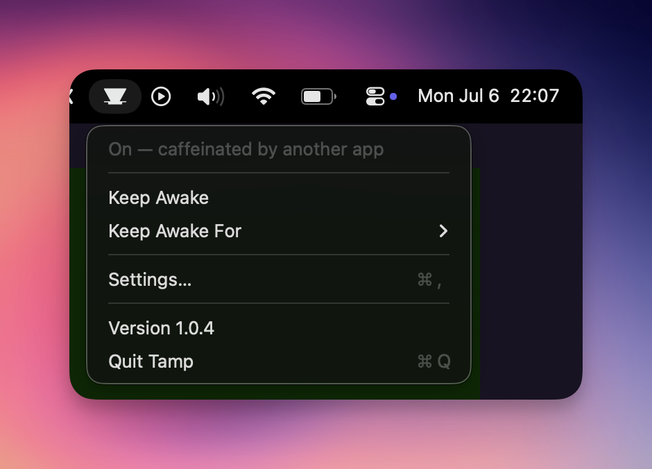
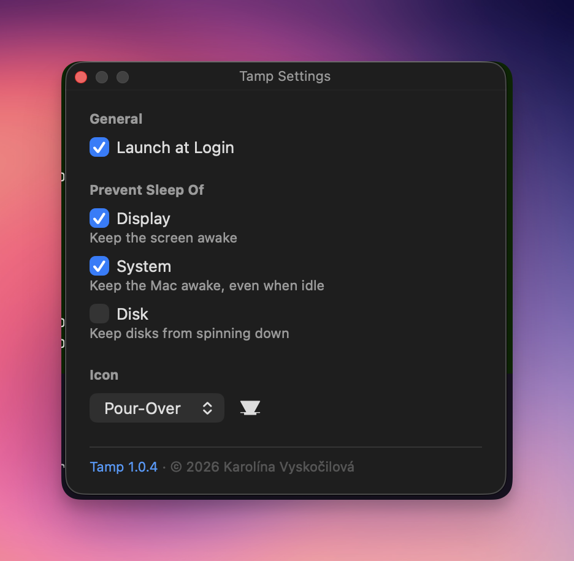

# Tamp

[](https://github.com/vyskoczilova/tamp/releases)
[](LICENSE)

[](https://github.com/vyskoczilova/homebrew-tap)

**Website: [tamp.kybernaut.cz](https://tamp.kybernaut.cz)**

**Tamp is a free, open-source macOS menu bar app and CLI that keeps your Mac
awake — a lightweight wrapper around Apple's built-in `caffeinate`. Unlike
other keep-awake tools, Tamp also detects when *another* app is caffeinating
your Mac — and names the process that's doing it — so the menu bar reflects
the machine's real state.**

<p align="center">
  
  
</p>

Named after the coffee tamper (and the menu bar icon that goes with it).

## Install

```sh
brew install vyskoczilova/tap/tamp
```

Then copy the menu bar app to /Applications (see the formula caveats):

```sh
cp -R "$(brew --prefix tamp)/Tamp.app" /Applications/
open /Applications/Tamp.app
```

**Requirements:** macOS 13 Ventura or later. Homebrew installs universal
binaries (Apple Silicon + Intel); no Xcode or developer tools needed.

## What it does

- **Shows the truth about your Mac's sleep** — if any other tool (Amphetamine,
  a script, Claude Code hooks…) runs `caffeinate`, Tamp's icon fills and the
  status names the culprit: "On — caffeinated by bash (pid 1234)"
- **Toggle** keep-awake on/off from the menu bar or with `tamp toggle`
- **Caffeinate for** a duration (`30m`, `1h`, `1h30m`, `90s`; capped at 7 days)
  or **until** a clock time (`17:30`)
- Independently prevent **display / system / disk** sleep
- The `tamp` CLI and the menu bar app share one source of truth — change state
  in one and the other reflects it immediately
- Selectable menu bar icon styles, including coffee **brewing concepts**
  (tamper, pour-over, filter, pot)

## How it compares

|                                             | Tamp     | Amphetamine       | KeepingYouAwake | Caffeine |
| ------------------------------------------- | :------: | :---------------: | :-------------: | :------: |
| Menu bar app                                 | ✅       | ✅                | ✅              | ✅       |
| CLI sharing state with the app               | ✅       | ❌                | ❌              | ❌       |
| Shows *which* app keeps the Mac awake        | ✅       | ❌                | ❌              | ❌       |
| Keep awake until a specific time             | ✅       | ✅                | ❌              | ❌       |
| Timed sessions (durations)                   | ✅       | ✅                | ✅              | ✅       |
| Homebrew install                             | ✅ tap   | ❌ App Store      | ✅ cask         | ✅ cask  |
| Open source                                  | ✅ MIT   | ❌ (free, closed) | ✅ MIT          | ✅ MIT   |

*Based on each project's published documentation as of July 2026. Amphetamine
offers an extensive trigger/automation system that Tamp doesn't attempt to
match — if you need that, use Amphetamine.*

## CLI usage

```sh
tamp on              # keep awake until turned off
tamp off             # allow sleep again
tamp toggle          # flip current state
tamp for 2h          # keep awake for 2 hours
tamp until 17:30     # keep awake until 17:30 (rolls to tomorrow if past)
tamp status          # show state, naming any external caffeinator
                     # ( --json for scripting: resolved phase + externalSources )
tamp icon            # list icon styles ( * marks current )
tamp icon pourOver   # set the menu bar icon style

# Per-run sleep overrides (otherwise saved preferences apply):
tamp on --no-display --system
```

## How it works

Each session shells out to `/usr/bin/caffeinate` with flags mapped from your
preferences (`-d` display, `-i` idle system, `-m` disk) and `-t <seconds>` for
timed sessions. The running PID and session details are persisted to
`~/Library/Application Support/Tamp/state.json`; the menu bar app watches that
file so CLI changes show up immediately. If a tracked process dies (timer
elapsed or manual kill), the state self-reconciles to "off" — and a recorded
PID is never trusted (or killed) unless it still names a caffeinate process,
so recycled PIDs are harmless.

When Tamp's own state is inactive, it also checks the live process list (via
libproc, in-process) for any external caffeinate keeping the Mac awake. If one
exists, Tamp resolves its parent process (again via libproc — no subprocesses)
and the icon and status line name it: "On — caffeinated by bash (pid 1234)".
If the launcher already exited and the caffeinate was orphaned to `launchd`,
Tamp says so honestly ("an orphaned caffeinate (pid 5678 — parent exited)")
instead of misattributing it. Everything stays read-only — Tamp never touches
external processes. See `docs/adr/001-system-aware-caffeinate-detection.md`.

## FAQ

**Is Tamp free?**
Yes — free and open source under the MIT license.

**What macOS version does Tamp require?**
macOS 13 Ventura or later. The Homebrew formula ships universal binaries for
Apple Silicon and Intel Macs.

**Do I need Xcode?**
No. Installing via Homebrew needs nothing extra. Building from source needs
only the Swift 6+ toolchain (Command Line Tools are enough).

**How is Tamp different from Amphetamine or KeepingYouAwake?**
Tamp ships both a CLI and a menu bar app that share one state, and it uniquely
shows *which* app is keeping your Mac awake instead of pretending the machine
is free to sleep.

**Something keeps my Mac awake — how do I find out what?**
Run `tamp status` (or glance at the menu bar): if any `caffeinate` is running,
Tamp names the process that launched it, e.g. "caffeinated by bash (pid 1234)".
No more hunting through Activity Monitor. If the launcher already exited, the
orphaned `caffeinate`'s own PID is shown so you can still deal with it.

**Does Tamp drain my battery?**
No. Keep-awake itself is Apple's native `caffeinate`; Tamp's own footprint is
a menu bar icon plus a lightweight in-process check (no subprocesses) that
notices external keep-awake activity while idle.

**Can I keep only the display awake (or only the system)?**
Yes — display, system, and disk sleep are controlled independently, per run
(`tamp on --display --no-system`) or as saved preferences in the app's
Settings.

**Where does Tamp store its state?**
`~/Library/Application Support/Tamp/state.json` plus a small preferences
suite (`cz.kybernaut.tamp`). `Scripts/uninstall.sh` removes both.

## Build from source

Requires the Swift toolchain (Swift 6+). No Xcode needed.

```sh
swift build -c release
```

Binaries land in `.build/release/`:

- `tamp` — the CLI
- `TampBar` — the menu bar app (runs as a background "accessory", no Dock icon)

Package the menu bar app as a real `Tamp.app` bundle (ad-hoc signed, no Dock
icon) and run it like any other app:

```sh
Scripts/make-app.sh --install   # builds build/Tamp.app, installs to /Applications, launches
```

A coffee-tamper icon appears in the menu bar. To start it automatically at
login, click the icon → **Settings…** → **Launch at Login** (uses
`SMAppService`; the app must live in `/Applications`).

You can also run the bare binary without bundling — `.build/release/TampBar &` —
but then the "Launch at Login" toggle is disabled (it needs a real `.app`).

## Tests

```sh
swift run TampKitChecks
```

(A plain executable harness — the standard test frameworks require full Xcode,
which this setup doesn't have.)

## Uninstall

```sh
Scripts/uninstall.sh   # stops the session, unregisters login item, removes app/state/prefs
```

## Roadmap

See [`TODO.md`](TODO.md) for the up-to-date backlog.

## License & attribution

MIT — see `LICENSE`. Original implementation, inspired by the MIT-licensed
Raycast "Coffee" extension — no code or artwork was copied; only the public
behavior of Apple's `caffeinate` is wrapped.

Icon artwork from the [Noun Project](https://thenounproject.com), used under
[CC BY 3.0](https://creativecommons.org/licenses/by/3.0/): icons by
Mila Karmila, Styfico, mikicon, erix subyarko, little_dipper_studio, and
Side Project — per-icon details in `Sources/TampBar/Icons/CREDITS.txt`.
